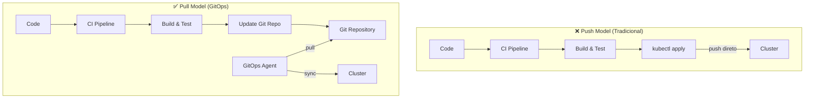
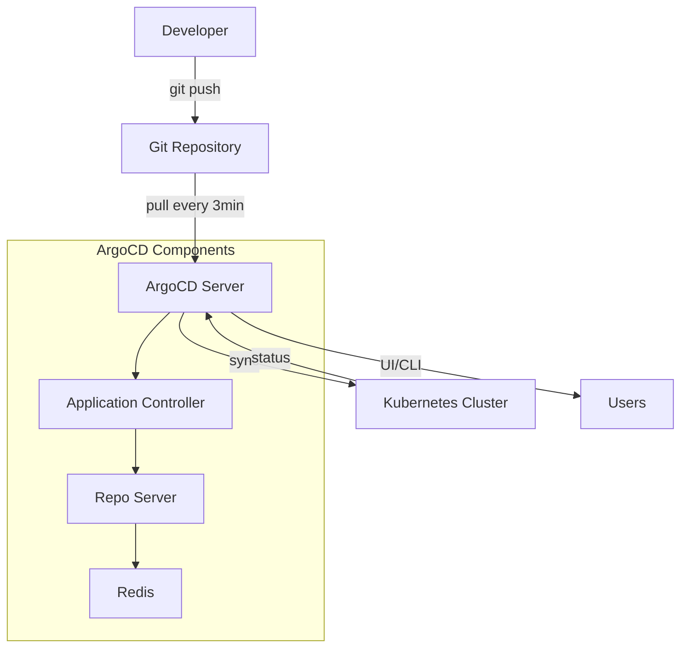
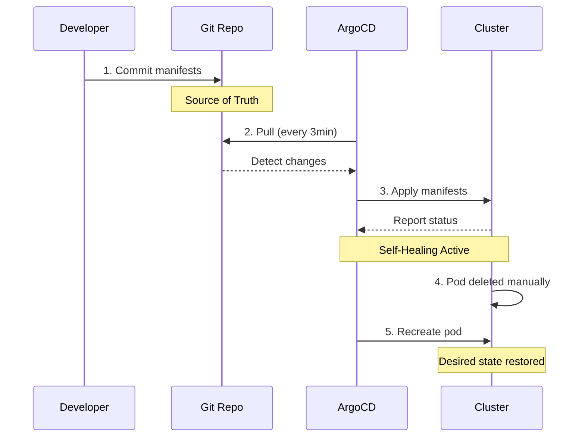

# 🎬 Vídeo 4.1 - GitOps com ArgoCD

**Aula**: 4 - GitOps  
**Vídeo**: 4.1  
**Temas**: GitOps; ArgoCD; Continuous Deployment; Sync  

---

## 📚 Parte 1: Conceito GitOps

### Passo 1: O que é GitOps?

#### CI/CD Tradicional vs GitOps



**Diferenças:**

| Aspecto | Push Model | Pull Model (GitOps) |
|---------|------------|---------------------|
| **Acesso ao Cluster** | ❌ Pipeline precisa credenciais | ✅ Agent no cluster |
| **Auditoria** | ❌ Difícil rastrear | ✅ Git history completo |
| **Estado** | ❌ Pode divergir | ✅ Git = Source of Truth |
| **Self-Healing** | ❌ Manual | ✅ Automático |
| **Segurança** | ❌ Credenciais expostas | ✅ Sem credenciais externas |

---

## ⚙️ Parte 2: Setup ArgoCD

### Passo 2: Verificar Cluster EKS

**⚠️ PRÉ-REQUISITO IMPORTANTE:**

O cluster EKS `cicd-lab` deve ter sido criado na **Aula 01**. Se você ainda não criou o cluster, **volte para o repositório da Aula 01** e siga os passos de criação do cluster EKS.

**Repositório Aula 01**: [Link para repositório da Aula 01]

```bash
# Verificar se o cluster existe
aws eks describe-cluster \
  --name cicd-lab \
  --region us-east-1 \
  --profile fiapaws

# Configurar kubectl (caso ainda não tenha configurado)
aws eks update-kubeconfig \
  --name cicd-lab \
  --region us-east-1 \
  --profile fiapaws

# Verificar nodes
kubectl get nodes

# Verificar contexto atual
kubectl config current-context
```

**Resultado esperado:**
```
NAME                                          STATUS   ROLES    AGE   VERSION
ip-10-0-1-123.us-east-1.compute.internal     Ready    <none>   1d    v1.28.x
ip-10-0-2-456.us-east-1.compute.internal     Ready    <none>   1d    v1.28.x
```

**⚠️ Se o cluster não existir:**
- Retorne ao repositório da **Aula 01**
- Siga os passos de criação do cluster EKS
- O cluster deve ter o nome: `cicd-lab`
- Região: `us-east-1`
- Profile AWS: `fiapaws`

### Passo 3: Instalar ArgoCD

```bash
# Criar namespace
kubectl create namespace argocd

# Instalar ArgoCD
kubectl apply -n argocd -f https://raw.githubusercontent.com/argoproj/argo-cd/stable/manifests/install.yaml

# Aguardar pods ficarem prontos (2-3 min)
kubectl wait --for=condition=ready pod -l app.kubernetes.io/name=argocd-server -n argocd --timeout=300s

# Ver pods
kubectl get pods -n argocd
```

### Passo 4: Acessar ArgoCD UI

```bash
# Expor ArgoCD via port-forward
kubectl port-forward svc/argocd-server -n argocd 8080:443 &

# Obter senha inicial
ARGOCD_PASSWORD=$(kubectl -n argocd get secret argocd-initial-admin-secret -o jsonpath="{.data.password}" | base64 -d)
echo "Password: $ARGOCD_PASSWORD"

# Acessar UI
open https://localhost:8080
# Login: admin / <senha_obtida>
# Aceitar certificado self-signed
```

### Passo 5: Instalar ArgoCD CLI

```bash
# macOS
brew install argocd

# Linux
curl -sSL -o argocd-linux-amd64 https://github.com/argoproj/argo-cd/releases/latest/download/argocd-linux-amd64
sudo install -m 555 argocd-linux-amd64 /usr/local/bin/argocd
rm argocd-linux-amd64

# Verificar
argocd version
```

### Passo 6: Login via CLI

```bash
# Login
argocd login localhost:8080 \
  --username admin \
  --password $ARGOCD_PASSWORD \
  --insecure

# Mudar senha (opcional)
argocd account update-password
```

---

## 📁 Parte 3: Preparar GitOps Repository

### Passo 7: Entender Estrutura do GitOps Repo

```bash
cd fiap-dclt-aula04

# Ver estrutura completa
tree gitops-repo/
```

**Estrutura Completa:**
```
gitops-repo/
├── README.md                                    # Documentação do repositório
│
├── applications/                                # 📁 Definições de Aplicações
│   ├── fiap-todo-api/                          # Aplicação Todo API
│   │   ├── base/                               # 🔷 Manifests Base (comum a todos ambientes)
│   │   │   ├── deployment.yaml                 #    - Deployment da aplicação
│   │   │   ├── service.yaml                    #    - Service (ClusterIP)
│   │   │   └── kustomization.yaml              #    - Kustomize base config
│   │   │
│   │   └── overlays/                           # 🔶 Overlays (específico por ambiente)
│   │       └── production/                     #    - Ambiente de Produção
│   │           ├── kustomization.yaml          #      - Kustomize overlay config
│   │           └── deployment-patch.yaml       #      - Patches (replicas, resources, etc)
│   │
│   └── fiap-todo-api-app.yaml                  # 🎯 ArgoCD Application (define deploy)
│
└── clusters/                                    # 📁 Configurações FluxCD por Cluster
    └── production/                              # Cluster de Produção
        ├── fiap-todo-api-source.yaml           #    - GitRepository (source)
        └── fiap-todo-api-kustomization.yaml    #    - Kustomization (deploy)
```

**📖 Explicação da Estrutura:**

**1. `applications/fiap-todo-api/base/`** - Manifests Base
   - Contém os recursos Kubernetes **comuns a todos os ambientes**
   - `deployment.yaml`: Define pods, containers, imagem
   - `service.yaml`: Expõe a aplicação internamente
   - `kustomization.yaml`: Lista os recursos base

**2. `applications/fiap-todo-api/overlays/production/`** - Overlay de Produção
   - **Customiza** os manifests base para produção
   - `deployment-patch.yaml`: Altera replicas, resources, labels
   - `kustomization.yaml`: Referencia base + aplica patches
   - **Vantagem**: Mesma base, configurações diferentes por ambiente

**3. `applications/fiap-todo-api-app.yaml`** - ArgoCD Application
   - Define **como o ArgoCD** deve fazer deploy
   - Aponta para: Git repo + path dos manifests
   - Configura: auto-sync, self-healing, namespace destino

**4. `clusters/production/`** - Configurações FluxCD
   - Alternativa ao ArgoCD (mesmo propósito)
   - `*-source.yaml`: Define repositório Git
   - `*-kustomization.yaml`: Define como aplicar manifests

**🎯 Padrão Kustomize:**
```
Base (comum) + Overlay (específico) = Manifests Finais
```

**Exemplo:**
- **Base**: 2 replicas, 128Mi RAM
- **Overlay Production**: 5 replicas, 512Mi RAM
- **Resultado**: Deploy com 5 replicas e 512Mi RAM

### Passo 8: Ver Manifests Base

```bash
# Ver deployment
cat gitops-repo/applications/fiap-todo-api/base/deployment.yaml

# Ver service
cat gitops-repo/applications/fiap-todo-api/base/service.yaml

# Ver kustomization
cat gitops-repo/applications/fiap-todo-api/base/kustomization.yaml
```

---

## 🐳 Parte 4: Build e Push da Imagem Docker

### Passo 9: Criar Repositório ECR

```bash
# Obter Account ID
ACCOUNT_ID=$(aws sts get-caller-identity --profile fiapaws --query Account --output text)

# Criar repositório ECR
aws ecr create-repository \
  --repository-name fiap-todo-api \
  --region us-east-1 \
  --profile fiapaws

# Salvar URI do ECR
ECR_URI="${ACCOUNT_ID}.dkr.ecr.us-east-1.amazonaws.com"
echo "ECR URI: $ECR_URI"
```

### Passo 10: Build e Push da Imagem (Manual)

**⚠️ Nota Pedagógica:**
- Neste vídeo, faremos o build **manualmente** para entender o processo
- No **Vídeo 4.2**, automatizaremos isso com GitHub Actions
- A aplicação está no diretório `app/` deste repositório

```bash
# Login no ECR
aws ecr get-login-password \
  --region us-east-1 \
  --profile fiapaws | docker login \
  --username AWS \
  --password-stdin ${ECR_URI}

# Build da imagem (Dockerfile está na raiz do repositório)
docker build --platform linux/amd64 -t fiap-todo-api:v1.0.0 .

# Tag da imagem para o ECR
docker tag fiap-todo-api:v1.0.0 ${ECR_URI}/fiap-todo-api:v1.0.0

# Push para o ECR
docker push ${ECR_URI}/fiap-todo-api:v1.0.0

echo "✅ Imagem publicada: ${ECR_URI}/fiap-todo-api:v1.0.0"
```

**📁 Estrutura da aplicação:**
```
fiap-dclt-aula04/
├── Dockerfile          # Dockerfile da aplicação
├── app/                # Código fonte da aplicação
│   ├── package.json
│   └── src/
└── gitops-repo/        # Manifests GitOps
```

### Passo 11: Instalar Kustomize

```bash
# macOS
brew install kustomize

# Linux
curl -s "https://raw.githubusercontent.com/kubernetes-sigs/kustomize/master/hack/install_kustomize.sh" | bash
sudo mv kustomize /usr/local/bin/

# Verificar instalação
kustomize version
```

### Passo 12: Atualizar Manifests com a Imagem

```bash
# Atualizar kustomization.yaml com a imagem real
cd gitops-repo/applications/fiap-todo-api/overlays/production

# Verificar se ECR_URI está definido
echo "ECR URI: ${ECR_URI}"

# Editar com kustomize (substitui a imagem)
kustomize edit set image fiap-todo-api=${ECR_URI}/fiap-todo-api:v1.0.0

# Ver mudança
cat kustomization.yaml

# Voltar para o diretório raiz
cd ../../../../../
```

**⚠️ IMPORTANTE**: Verifique se a seção `images` no `kustomization.yaml` contém a URI real do ECR (não `YOUR_ECR_URI`).

**Resultado esperado em `kustomization.yaml`:**
```yaml
apiVersion: kustomize.config.k8s.io/v1beta1
kind: Kustomization

resources:
  - ../../base

images:
  - name: fiap-todo-api
    newName: 123456789012.dkr.ecr.us-east-1.amazonaws.com/fiap-todo-api
    newTag: v1.0.0

patches:
  - path: deployment-patch.yaml
```

### Passo 13: Commit e Push das Mudanças

```bash
# Adicionar mudanças
git add gitops-repo/applications/fiap-todo-api/overlays/production/kustomization.yaml

# Commit
git commit -m "feat: atualizar imagem para v1.0.0"

# Push para o GitHub
git push origin main

echo "✅ Manifests atualizados no Git!"
```

---

## 🚀 Parte 5: Deploy com ArgoCD

### Passo 14: Criar Application no ArgoCD

```bash
# Ver Application manifest
cat gitops-repo/applications/fiap-todo-api-app.yaml
```

**fiap-todo-api-app.yaml:**
```yaml
apiVersion: argoproj.io/v1alpha1
kind: Application
metadata:
  name: fiap-todo-api
  namespace: argocd
spec:
  project: default
  
  source:
    repoURL: https://github.com/josenetoo/fiap-dclt-aula04
    targetRevision: HEAD
    path: gitops-repo/applications/fiap-todo-api/overlays/production
  
  destination:
    server: https://kubernetes.default.svc
    namespace: fiap-todo-prod
  
  syncPolicy:
    automated:
      prune: true
      selfHeal: true
    syncOptions:
      - CreateNamespace=true
```

### Passo 15: Aplicar Application

```bash
# Criar namespace para a aplicação
kubectl create namespace fiap-todo-prod

# Aplicar Application
kubectl apply -f gitops-repo/applications/fiap-todo-api-app.yaml

# Ver Application
argocd app list

# Ver detalhes
argocd app get fiap-todo-api
```

### Passo 16: Sync Manual (primeira vez)

```bash
# Sync da aplicação
argocd app sync fiap-todo-api

# Aguardar sync completar
argocd app wait fiap-todo-api --health

# Ver status
argocd app get fiap-todo-api
```

---

## 🔄 Parte 6: Testar GitOps Workflow

### Passo 17: Ver Aplicação Deployada

```bash
# Ver pods
kubectl get pods -n fiap-todo-prod

# Ver service
kubectl get service -n fiap-todo-prod

# Ver logs
kubectl logs -l app=fiap-todo-api -n fiap-todo-prod --tail=50
```

### Passo 18: Fazer Mudança no Git

```bash
cd fiap-dclt-aula04

# Editar deployment (aumentar replicas)
cat > gitops-repo/applications/fiap-todo-api/overlays/production/deployment-patch.yaml << 'EOF'
apiVersion: apps/v1
kind: Deployment
metadata:
  name: fiap-todo-api
spec:
  replicas: 5  # Era 3, agora 5!
  template:
    spec:
      containers:
      - name: api
        resources:
          requests:
            memory: "256Mi"
            cpu: "200m"
          limits:
            memory: "512Mi"
            cpu: "500m"
EOF

# Commit e push
git add gitops-repo/
git commit -m "feat: aumentar replicas para 5"
git push origin main
```

### Passo 19: Ver Auto-Sync

```bash
# ArgoCD vai detectar a mudança automaticamente (3 min)
# Ver status
argocd app get fiap-todo-api

# Acompanhar sync
watch kubectl get pods -n fiap-todo-prod

# Após sync, verificar replicas
kubectl get deployment -n fiap-todo-prod
# Deve mostrar 5 replicas!
```

---

## 🔍 Parte 7: ArgoCD UI

### Passo 20: Explorar UI

**No ArgoCD UI (https://localhost:8080):**

1. **Applications** → Ver `fiap-todo-api`
2. Clicar na aplicação
3. Ver:
   - **Topology**: Visualização gráfica dos recursos
   - **Sync Status**: Synced / OutOfSync
   - **Health Status**: Healthy / Degraded
   - **Last Sync**: Timestamp da última sincronização

4. **App Details**:
   - Source: Git repo e path
   - Destination: Cluster e namespace
   - Sync Policy: Auto-sync habilitado

5. **History**:
   - Ver histórico de syncs
   - Cada commit do Git aparece aqui

### Passo 21: Testar Self-Healing

```bash
# Deletar um pod manualmente
POD=$(kubectl get pods -n fiap-todo-prod -l app=fiap-todo-api -o jsonpath='{.items[0].metadata.name}')
kubectl delete pod $POD -n fiap-todo-prod

# ArgoCD vai recriar automaticamente!
# Ver no UI: Self-healing em ação
kubectl get pods -n fiap-todo-prod -w
```

---

## 🎓 Parte 8: Conceitos Aprendidos

### Passo 22: Arquitetura ArgoCD



**Fluxo GitOps com ArgoCD:**



**Conceitos-chave:**
- ✅ **Git como source of truth** - Única fonte da verdade
- ✅ **Pull model** - Agent no cluster puxa mudanças
- ✅ **Auto-sync** - Sincronização automática (3 min)
- ✅ **Self-healing** - Recuperação automática de estado
- ✅ **Auditoria** - Git history completo
- ✅ **Rollback** - git revert para voltar versões
- ✅ **UI visual** - Interface gráfica para monitoramento

---

**FIM DO VÍDEO 4.1** ✅
