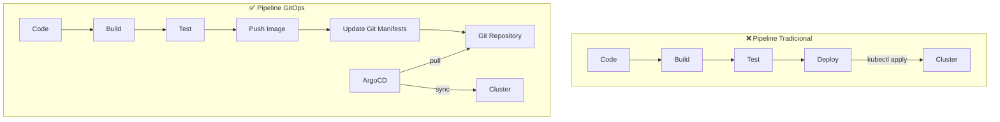
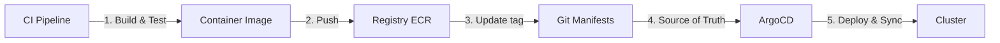
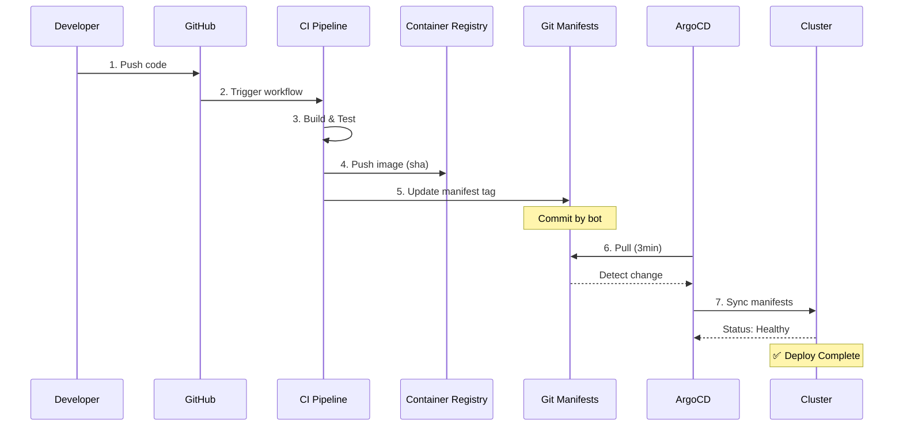
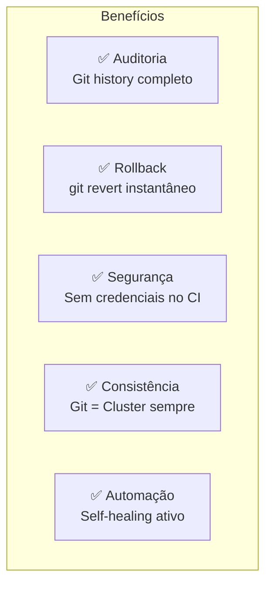

# 🎬 Vídeo 4.2 - Pipeline GitOps Automatizado

**Aula**: 4 - GitOps  
**Vídeo**: 4.2  
**Temas**: CI/CD + GitOps; Update manifests; ArgoCD Sync; Automation  

---

## ⚠️ Pré-requisitos

**IMPORTANTE**: Este vídeo assume que você já tem:
- ✅ Cluster EKS `cicd-lab` criado na **Aula 01** (repositório da Aula 01)
- ✅ ArgoCD instalado e configurado (Vídeo 4.1)
- ✅ kubectl configurado com acesso ao cluster

**Se ainda não criou o cluster:**
- Volte ao **repositório da Aula 01** e crie o cluster EKS
- O cluster deve ter o nome: `cicd-lab`
- Depois retorne ao **Vídeo 4.1** para instalar o ArgoCD

---

## 📚 Parte 1: Conceito CI/CD + GitOps

### Passo 1: Fluxo Completo CI/CD + GitOps



**Separação de responsabilidades:**



| Componente | Responsabilidade |
|------------|------------------|
| **CI Pipeline** | Build, test, push image |
| **Git Repository** | Source of truth para manifests |
| **ArgoCD** | Deploy e sync automático |
| **Cluster** | Executar aplicações |

---

## � Parte 2: Configurar Secrets no GitHub

### Passo 2: Adicionar AWS Credentials como Secrets

**⚠️ IMPORTANTE**: Configure os secrets ANTES de criar os workflows!

**Onde configurar:**
1. Acesse seu repositório no GitHub
2. **Settings** → **Secrets and variables** → **Actions**
3. Clique em **New repository secret**

**Secrets necessários:**

| Secret Name | Descrição | Como obter |
|-------------|-----------|------------|
| `AWS_ACCESS_KEY_ID` | Access Key ID da AWS | AWS Learner Lab → AWS Details → Show |
| `AWS_SECRET_ACCESS_KEY` | Secret Access Key da AWS | AWS Learner Lab → AWS Details → Show |
| `AWS_SESSION_TOKEN` | Session Token (AWS Learner Lab) | AWS Learner Lab → AWS Details → Show |
| `ARGOCD_PASSWORD` | Senha do ArgoCD admin | `kubectl -n argocd get secret argocd-initial-admin-secret -o jsonpath="{.data.password}" \| base64 -d` |

**Passo a passo para adicionar cada secret:**
```
1. Clique em "New repository secret"
2. Name: AWS_ACCESS_KEY_ID
3. Secret: <cole o valor do AWS Learner Lab>
4. Clique em "Add secret"
5. Repita para os outros 3 secrets
```

**⚠️ Nota sobre AWS Learner Lab:**
- Os secrets AWS expiram quando a sessão do Learner Lab termina
- Você precisará atualizar os secrets a cada nova sessão
- Sempre inicie o Learner Lab antes de executar workflows

---

## 🔄 Parte 3: Criar Workflows GitHub Actions

### Passo 3: Criar Estrutura de Diretórios

```bash
# Navegar para o diretório do projeto
cd fiap-dclt-aula04

# Criar estrutura de diretórios
mkdir -p .github/workflows

# Verificar
ls -la .github/workflows/
```

---

## 📦 Parte 4: Workflow 1 - Build e Push Docker

### Passo 4: Criar docker-build.yml

**Linux / macOS:**
```bash
# Navegar para o diretório do projeto
cd fiap-dclt-aula04

# Criar estrutura de diretórios
mkdir -p .github/workflows

# Criar arquivo docker-build.yml
cat > .github/workflows/docker-build.yml << 'EOF'
name: 🐳 Build and Push Docker Image

on:
  push:
    branches: [ main ]
    paths: 
      - 'app/**'
  workflow_dispatch:

env:
  AWS_REGION: us-east-1
  ECR_REPOSITORY: fiap-todo-api

jobs:
  build:
    name: 🏗️ Build and Push
    runs-on: ubuntu-latest
    
    steps:
      - name: 📥 Checkout código
        uses: actions/checkout@v4
      
      - name: 🔑 Configure AWS credentials
        uses: aws-actions/configure-aws-credentials@v4
        with:
          aws-access-key-id: ${{ secrets.AWS_ACCESS_KEY_ID }}
          aws-secret-access-key: ${{ secrets.AWS_SECRET_ACCESS_KEY }}
          aws-session-token: ${{ secrets.AWS_SESSION_TOKEN }}
          aws-region: ${{ env.AWS_REGION }}
      
      - name: 🔐 Login to Amazon ECR
        id: login-ecr
        uses: aws-actions/amazon-ecr-login@v2
      
      - name: 🐳 Build, tag, and push image
        env:
          ECR_REGISTRY: ${{ steps.login-ecr.outputs.registry }}
          IMAGE_TAG: ${{ github.sha }}
        run: |
          docker build --platform linux/amd64 -t $ECR_REGISTRY/$ECR_REPOSITORY:$IMAGE_TAG ./app
          docker push $ECR_REGISTRY/$ECR_REPOSITORY:$IMAGE_TAG
          echo "✅ Image pushed: $ECR_REGISTRY/$ECR_REPOSITORY:$IMAGE_TAG"
      
      - name: 📊 Summary
        env:
          ECR_REGISTRY: ${{ steps.login-ecr.outputs.registry }}
          IMAGE_TAG: ${{ github.sha }}
        run: |
          echo "## 🐳 Docker Build Summary" >> $GITHUB_STEP_SUMMARY
          echo "" >> $GITHUB_STEP_SUMMARY
          echo "**Image:** \`$ECR_REGISTRY/$ECR_REPOSITORY:$IMAGE_TAG\`" >> $GITHUB_STEP_SUMMARY
          echo "**Status:** ✅ Built and Pushed" >> $GITHUB_STEP_SUMMARY
EOF

echo "✅ Arquivo docker-build.yml criado!"
```

**Windows (PowerShell):** *(ver seção Windows abaixo)*

---

## 📝 Parte 5: Workflow 2 - Update Image Tag

### Passo 5: Criar update-image.yml

**Linux / macOS:**
```bash
# Criar arquivo update-image.yml
cat > .github/workflows/update-image.yml << 'EOF'
name: 🔄 Update Image Tag in GitOps Repo

on:
  workflow_dispatch:
    inputs:
      image_tag:
        description: 'New image tag to deploy'
        required: true
        type: string
      environment:
        description: 'Target environment'
        required: true
        type: choice
        options:
          - production

permissions:
  contents: write

jobs:
  update-gitops-repo:
    name: 📝 Update GitOps Repository
    runs-on: ubuntu-latest
    
    steps:
      - name: 📥 Checkout código
        uses: actions/checkout@v4
        with:
          token: ${{ secrets.GITHUB_TOKEN }}
      
      - name: 🔧 Setup Kustomize
        run: |
          curl -s "https://raw.githubusercontent.com/kubernetes-sigs/kustomize/master/hack/install_kustomize.sh" | bash
          sudo mv kustomize /usr/local/bin/
      
      - name: 📝 Update image tag
        run: |
          cd gitops-repo/applications/fiap-todo-api/overlays/${{ inputs.environment }}
          
          # Update image tag in kustomization.yaml
          kustomize edit set image \
            fiap-todo-api=YOUR_ECR_URI/fiap-todo-api:${{ inputs.image_tag }}
          
          echo "✅ Updated image tag to: ${{ inputs.image_tag }}"
      
      - name: 💾 Commit and push changes
        run: |
          git config user.name "GitHub Actions Bot"
          git config user.email "actions@github.com"
          
          git add gitops-repo/applications/fiap-todo-api/overlays/${{ inputs.environment }}/kustomization.yaml
          
          git commit -m "🚀 Update ${{ inputs.environment }} image to ${{ inputs.image_tag }}"
          
          git push origin main
      
      - name: 📊 Summary
        run: |
          echo "## 🚀 GitOps Update Summary" >> $GITHUB_STEP_SUMMARY
          echo "" >> $GITHUB_STEP_SUMMARY
          echo "**Environment:** ${{ inputs.environment }}" >> $GITHUB_STEP_SUMMARY
          echo "**New Image Tag:** ${{ inputs.image_tag }}" >> $GITHUB_STEP_SUMMARY
          echo "**Status:** ✅ Updated" >> $GITHUB_STEP_SUMMARY
          echo "" >> $GITHUB_STEP_SUMMARY
          echo "ArgoCD will automatically sync this change." >> $GITHUB_STEP_SUMMARY
EOF

echo "✅ Arquivo update-image.yml criado!"
```

**Windows (PowerShell):** *(ver seção Windows abaixo)*

---

## 🔄 Parte 6: Workflow 3 - ArgoCD Sync

### Passo 6: Criar argocd-sync.yml

**Linux / macOS:**
```bash
# Criar arquivo argocd-sync.yml
cat > .github/workflows/argocd-sync.yml << 'EOF'
name: 🔄 ArgoCD GitOps Sync

on:
  push:
    branches: [ main ]
    paths:
      - 'gitops-repo/**'
  workflow_dispatch:

env:
  ARGOCD_SERVER: 'localhost:8080'
  ARGOCD_APP_NAME: 'fiap-todo-api'

jobs:
  validate-manifests:
    name: ✅ Validate Kubernetes Manifests
    runs-on: ubuntu-latest
    
    steps:
      - name: 📥 Checkout código
        uses: actions/checkout@v4
      
      - name: 🔧 Setup Kustomize
        run: |
          curl -s "https://raw.githubusercontent.com/kubernetes-sigs/kustomize/master/hack/install_kustomize.sh" | bash
          sudo mv kustomize /usr/local/bin/
      
      - name: ✅ Validate Kustomize
        run: |
          cd gitops-repo/applications/fiap-todo-api/overlays/production
          kustomize build . > /tmp/manifests.yaml
          echo "✅ Kustomize build successful"
      
      - name: 🔍 Validate YAML
        run: |
          pip install yamllint
          find gitops-repo -name "*.yaml" -o -name "*.yml" | xargs yamllint -d relaxed

  argocd-sync:
    name: 🚀 Sync ArgoCD Application
    runs-on: ubuntu-latest
    needs: validate-manifests
    if: github.event_name == 'workflow_dispatch'
    
    steps:
      - name: 📥 Checkout código
        uses: actions/checkout@v4
      
      - name: 🔧 Install ArgoCD CLI
        run: |
          curl -sSL -o argocd-linux-amd64 https://github.com/argoproj/argo-cd/releases/latest/download/argocd-linux-amd64
          sudo install -m 555 argocd-linux-amd64 /usr/local/bin/argocd
          rm argocd-linux-amd64
      
      - name: 🔑 Login to ArgoCD
        run: |
          argocd login ${{ env.ARGOCD_SERVER }} \
            --username admin \
            --password ${{ secrets.ARGOCD_PASSWORD }} \
            --insecure
      
      - name: 🔄 Sync Application
        run: |
          echo "🔄 Syncing ArgoCD application: ${{ env.ARGOCD_APP_NAME }}"
          
          argocd app sync ${{ env.ARGOCD_APP_NAME }} \
            --prune \
            --timeout 300
      
      - name: ⏳ Wait for Sync
        run: |
          echo "⏳ Waiting for application to be healthy..."
          
          argocd app wait ${{ env.ARGOCD_APP_NAME }} \
            --health \
            --timeout 300
      
      - name: 📊 Get Application Status
        run: |
          echo "📊 Application Status:"
          argocd app get ${{ env.ARGOCD_APP_NAME }}
          
          echo "## 🚀 ArgoCD Sync Summary" >> $GITHUB_STEP_SUMMARY
          echo "" >> $GITHUB_STEP_SUMMARY
          echo "**Application:** ${{ env.ARGOCD_APP_NAME }}" >> $GITHUB_STEP_SUMMARY
          echo "**Status:** ✅ Synced and Healthy" >> $GITHUB_STEP_SUMMARY
EOF

echo "✅ Arquivo argocd-sync.yml criado!"
```

**Windows (PowerShell):** *(ver seção Windows abaixo)*

### Passo 7: Verificar Arquivos Criados

```bash
# Listar arquivos criados
ls -la .github/workflows/

# Deve mostrar:
# docker-build.yml
# update-image.yml
# argocd-sync.yml

# Ver conteúdo de um arquivo (exemplo)
cat .github/workflows/docker-build.yml
```

---

## 💻 Parte 7: Comandos para Windows

### Passo 8: Criar Todos os Workflows (Windows PowerShell)

**⚠️ Nota**: Execute cada bloco separadamente no PowerShell.

**Criar docker-build.yml:**
```powershell
# Navegar para o diretório do projeto
cd fiap-dclt-aula04

# Criar estrutura de diretórios
New-Item -ItemType Directory -Force -Path .github\workflows

# Criar arquivo docker-build.yml
@"
name: 🐳 Build and Push Docker Image

on:
  push:
    branches: [ main ]
    paths: 
      - 'app/**'
  workflow_dispatch:

env:
  AWS_REGION: us-east-1
  ECR_REPOSITORY: fiap-todo-api

jobs:
  build:
    name: 🏗️ Build and Push
    runs-on: ubuntu-latest
    
    steps:
      - name: 📥 Checkout código
        uses: actions/checkout@v4
      
      - name: 🔑 Configure AWS credentials
        uses: aws-actions/configure-aws-credentials@v4
        with:
          aws-access-key-id: `${{ secrets.AWS_ACCESS_KEY_ID }}
          aws-secret-access-key: `${{ secrets.AWS_SECRET_ACCESS_KEY }}
          aws-session-token: `${{ secrets.AWS_SESSION_TOKEN }}
          aws-region: `${{ env.AWS_REGION }}
      
      - name: 🔐 Login to Amazon ECR
        id: login-ecr
        uses: aws-actions/amazon-ecr-login@v2
      
      - name: 🐳 Build, tag, and push image
        env:
          ECR_REGISTRY: `${{ steps.login-ecr.outputs.registry }}
          IMAGE_TAG: `${{ github.sha }}
        run: |
          docker build --platform linux/amd64 -t `$ECR_REGISTRY/`$ECR_REPOSITORY:`$IMAGE_TAG ./app
          docker push `$ECR_REGISTRY/`$ECR_REPOSITORY:`$IMAGE_TAG
          echo "✅ Image pushed: `$ECR_REGISTRY/`$ECR_REPOSITORY:`$IMAGE_TAG"
      
      - name: 📊 Summary
        env:
          ECR_REGISTRY: `${{ steps.login-ecr.outputs.registry }}
          IMAGE_TAG: `${{ github.sha }}
        run: |
          echo "## 🐳 Docker Build Summary" >> `$GITHUB_STEP_SUMMARY
          echo "" >> `$GITHUB_STEP_SUMMARY
          echo "**Image:** \``$ECR_REGISTRY/`$ECR_REPOSITORY:`$IMAGE_TAG\`" >> `$GITHUB_STEP_SUMMARY
          echo "**Status:** ✅ Built and Pushed" >> `$GITHUB_STEP_SUMMARY
"@ | Out-File -FilePath .github\workflows\docker-build.yml -Encoding UTF8

# Criar arquivo update-image.yml
@"
name: 🔄 Update Image Tag in GitOps Repo

on:
  workflow_dispatch:
    inputs:
      image_tag:
        description: 'New image tag to deploy'
        required: true
        type: string
      environment:
        description: 'Target environment'
        required: true
        type: choice
        options:
          - production

permissions:
  contents: write

jobs:
  update-gitops-repo:
    name: 📝 Update GitOps Repository
    runs-on: ubuntu-latest
    
    steps:
      - name: 📥 Checkout código
        uses: actions/checkout@v4
        with:
          token: `${{ secrets.GITHUB_TOKEN }}
      
      - name: 🔧 Setup Kustomize
        run: |
          curl -s "https://raw.githubusercontent.com/kubernetes-sigs/kustomize/master/hack/install_kustomize.sh" | bash
          sudo mv kustomize /usr/local/bin/
      
      - name: 📝 Update image tag
        run: |
          cd gitops-repo/applications/fiap-todo-api/overlays/`${{ inputs.environment }}
          
          # Update image tag in kustomization.yaml
          kustomize edit set image \
            fiap-todo-api=YOUR_ECR_URI/fiap-todo-api:`${{ inputs.image_tag }}
          
          echo "✅ Updated image tag to: `${{ inputs.image_tag }}"
      
      - name: 💾 Commit and push changes
        run: |
          git config user.name "GitHub Actions Bot"
          git config user.email "actions@github.com"
          
          git add gitops-repo/applications/fiap-todo-api/overlays/`${{ inputs.environment }}/kustomization.yaml
          
          git commit -m "🚀 Update `${{ inputs.environment }} image to `${{ inputs.image_tag }}"
          
          git push origin main
      
      - name: 📊 Summary
        run: |
          echo "## 🚀 GitOps Update Summary" >> `$GITHUB_STEP_SUMMARY
          echo "" >> `$GITHUB_STEP_SUMMARY
          echo "**Environment:** `${{ inputs.environment }}" >> `$GITHUB_STEP_SUMMARY
          echo "**New Image Tag:** `${{ inputs.image_tag }}" >> `$GITHUB_STEP_SUMMARY
          echo "**Status:** ✅ Updated" >> `$GITHUB_STEP_SUMMARY
          echo "" >> `$GITHUB_STEP_SUMMARY
          echo "ArgoCD will automatically sync this change." >> `$GITHUB_STEP_SUMMARY
"@ | Out-File -FilePath .github\workflows\update-image.yml -Encoding UTF8

# Criar arquivo argocd-sync.yml
@"
name: 🔄 ArgoCD GitOps Sync

on:
  push:
    branches: [ main ]
    paths:
      - 'gitops-repo/**'
  workflow_dispatch:

env:
  ARGOCD_SERVER: 'localhost:8080'
  ARGOCD_APP_NAME: 'fiap-todo-api'

jobs:
  validate-manifests:
    name: ✅ Validate Kubernetes Manifests
    runs-on: ubuntu-latest
    
    steps:
      - name: 📥 Checkout código
        uses: actions/checkout@v4
      
      - name: 🔧 Setup Kustomize
        run: |
          curl -s "https://raw.githubusercontent.com/kubernetes-sigs/kustomize/master/hack/install_kustomize.sh" | bash
          sudo mv kustomize /usr/local/bin/
      
      - name: ✅ Validate Kustomize
        run: |
          cd gitops-repo/applications/fiap-todo-api/overlays/production
          kustomize build . > /tmp/manifests.yaml
          echo "✅ Kustomize build successful"
      
      - name: 🔍 Validate YAML
        run: |
          pip install yamllint
          find gitops-repo -name "*.yaml" -o -name "*.yml" | xargs yamllint -d relaxed

  argocd-sync:
    name: 🚀 Sync ArgoCD Application
    runs-on: ubuntu-latest
    needs: validate-manifests
    if: github.event_name == 'workflow_dispatch'
    
    steps:
      - name: 📥 Checkout código
        uses: actions/checkout@v4
      
      - name: 🔧 Install ArgoCD CLI
        run: |
          curl -sSL -o argocd-linux-amd64 https://github.com/argoproj/argo-cd/releases/latest/download/argocd-linux-amd64
          sudo install -m 555 argocd-linux-amd64 /usr/local/bin/argocd
          rm argocd-linux-amd64
      
      - name: 🔑 Login to ArgoCD
        run: |
          argocd login `${{ env.ARGOCD_SERVER }} \
            --username admin \
            --password `${{ secrets.ARGOCD_PASSWORD }} \
            --insecure
      
      - name: 🔄 Sync Application
        run: |
          echo "🔄 Syncing ArgoCD application: `${{ env.ARGOCD_APP_NAME }}"
          
          argocd app sync `${{ env.ARGOCD_APP_NAME }} \
            --prune \
            --timeout 300
      
      - name: ⏳ Wait for Sync
        run: |
          echo "⏳ Waiting for application to be healthy..."
          
          argocd app wait `${{ env.ARGOCD_APP_NAME }} \
            --health \
            --timeout 300
      
      - name: 📊 Get Application Status
        run: |
          echo "📊 Application Status:"
          argocd app get `${{ env.ARGOCD_APP_NAME }}
          
          echo "## 🚀 ArgoCD Sync Summary" >> `$GITHUB_STEP_SUMMARY
          echo "" >> `$GITHUB_STEP_SUMMARY
          echo "**Application:** `${{ env.ARGOCD_APP_NAME }}" >> `$GITHUB_STEP_SUMMARY
          echo "**Status:** ✅ Synced and Healthy" >> `$GITHUB_STEP_SUMMARY
"@ | Out-File -FilePath .github\workflows\argocd-sync.yml -Encoding UTF8

Write-Host "✅ Arquivos GitHub Actions criados com sucesso!" -ForegroundColor Green
```

### Passo 3: Verificar Arquivos Criados

```bash
# Ver estrutura criada
tree .github/

# Listar arquivos
ls -la .github/workflows/

# Verificar conteúdo (exemplo)
cat .github/workflows/docker-build.yml
```

---

## 📝 Parte 3: Configurar Secrets no GitHub

### Passo 4: Adicionar AWS Credentials

No GitHub, vá em: **Settings** → **Secrets and variables** → **Actions** → **New repository secret**

Adicione os seguintes secrets:
- `AWS_ACCESS_KEY_ID`
- `AWS_SECRET_ACCESS_KEY`
- `AWS_SESSION_TOKEN` (para AWS Learner Lab)
- `ARGOCD_PASSWORD` (senha do ArgoCD admin)

---

## 🔄 Parte 4: Pipeline de Build

### Passo 5: Ver Workflow Docker Build

```bash
cd fiap-dclt-aula04

# Ver workflow
cat .github/workflows/docker-build.yml
```

**Workflow simplificado:**
```yaml
name: 🐳 Build and Push

on:
  push:
    branches: [ main ]
    paths: [ 'app/**' ]

jobs:
  build:
    runs-on: ubuntu-latest
    steps:
      - name: 📥 Checkout
        uses: actions/checkout@v4
      
      - name: 🐳 Build and Push
        run: |
          # Build Docker image
          docker build --platform linux/amd64 -t $ECR_URI/fiap-todo-api:${{ github.sha }} .
          
          # Push to ECR
          docker push $ECR_URI/fiap-todo-api:${{ github.sha }}
```

---

## 📝 Parte 3: Update Manifests Automaticamente

### Passo 3: Ver Workflow Update Image

```bash
# Ver workflow
cat .github/workflows/update-image.yml
```

**update-image.yml:**
```yaml
name: 🔄 Update Image Tag in GitOps Repo

on:
  workflow_dispatch:
    inputs:
      image_tag:
        description: 'New image tag to deploy'
        required: true
        type: string
      environment:
        description: 'Target environment'
        required: true
        type: choice
        options:
          - development
          - staging
          - production

jobs:
  update-gitops-repo:
    name: 📝 Update GitOps Repository
    runs-on: ubuntu-latest
    
    steps:
      - name: 📥 Checkout GitOps repo
        uses: actions/checkout@v4
        with:
          token: ${{ secrets.GITHUB_TOKEN }}
      
      - name: 🔧 Setup Kustomize
        run: |
          curl -s "https://raw.githubusercontent.com/kubernetes-sigs/kustomize/master/hack/install_kustomize.sh" | bash
          sudo mv kustomize /usr/local/bin/
      
      - name: 📝 Update image tag
        run: |
          cd gitops-repo/applications/fiap-todo-api/overlays/${{ inputs.environment }}
          
          # Update image tag in kustomization.yaml
          kustomize edit set image \
            YOUR_ECR_URI/fiap-todo-api:${{ inputs.image_tag }}
          
          echo "✅ Updated image tag to: ${{ inputs.image_tag }}"
      
      - name: 💾 Commit and push changes
        run: |
          git config user.name "GitHub Actions Bot"
          git config user.email "actions@github.com"
          
          git add gitops-repo/applications/fiap-todo-api/overlays/${{ inputs.environment }}/kustomization.yaml
          
          git commit -m "🚀 Update ${{ inputs.environment }} image to ${{ inputs.image_tag }}"
          
          git push origin main
      
      - name: 📊 Summary
        run: |
          echo "## 🚀 GitOps Update Summary" >> $GITHUB_STEP_SUMMARY
          echo "" >> $GITHUB_STEP_SUMMARY
          echo "**Environment:** ${{ inputs.environment }}" >> $GITHUB_STEP_SUMMARY
          echo "**New Image Tag:** ${{ inputs.image_tag }}" >> $GITHUB_STEP_SUMMARY
          echo "**Status:** ✅ Updated" >> $GITHUB_STEP_SUMMARY
          echo "" >> $GITHUB_STEP_SUMMARY
          echo "ArgoCD will automatically sync this change." >> $GITHUB_STEP_SUMMARY
```

---

## 🧪 Parte 4: Testar Pipeline Completo

### Passo 4: Trigger Update Manual

```bash
# No GitHub:
# 1. Actions → Update Image Tag in GitOps Repo
# 2. Run workflow
# 3. Inputs:
#    - image_tag: v1.2.3
#    - environment: production
# 4. Run workflow
```

### Passo 5: Ver Mudança no Git

```bash
cd fiap-dclt-aula04

# Pull mudanças
git pull origin main

# Ver commit do bot
git log -1

# Ver mudança no kustomization
cat gitops-repo/applications/fiap-todo-api/overlays/production/kustomization.yaml
```

### Passo 6: Ver ArgoCD Sync

```bash
# Ver status
argocd app get fiap-todo-api

# Aguardar sync (até 3 min)
argocd app wait fiap-todo-api --sync

# Ver nova imagem deployada
kubectl get pods -n fiap-todo-prod -o jsonpath='{.items[0].spec.containers[0].image}'
```

---

## 🔄 Parte 5: ArgoCD Sync Workflow

### Passo 7: Ver Workflow ArgoCD Sync

```bash
# Ver workflow
cat .github/workflows/argocd-sync.yml
```

**argocd-sync.yml:**
```yaml
name: 🔄 ArgoCD GitOps Sync

on:
  push:
    branches: [ main ]
    paths:
      - 'gitops-repo/**'
  workflow_dispatch:

env:
  ARGOCD_SERVER: 'argocd.example.com'
  ARGOCD_APP_NAME: 'fiap-todo-api'

jobs:
  validate-manifests:
    name: ✅ Validate Kubernetes Manifests
    runs-on: ubuntu-latest
    
    steps:
      - name: 📥 Checkout código
        uses: actions/checkout@v4
      
      - name: 🔧 Setup Kustomize
        run: |
          curl -s "https://raw.githubusercontent.com/kubernetes-sigs/kustomize/master/hack/install_kustomize.sh" | bash
          sudo mv kustomize /usr/local/bin/
      
      - name: ✅ Validate Kustomize
        run: |
          cd gitops-repo/applications/fiap-todo-api/overlays/production
          kustomize build . > /tmp/manifests.yaml
          echo "✅ Kustomize build successful"
      
      - name: 🔍 Validate YAML
        run: |
          pip install yamllint
          find gitops-repo -name "*.yaml" -o -name "*.yml" | xargs yamllint -d relaxed

  argocd-sync:
    name: 🚀 Sync ArgoCD Application
    runs-on: ubuntu-latest
    needs: validate-manifests
    
    steps:
      - name: 📥 Checkout código
        uses: actions/checkout@v4
      
      - name: 🔧 Install ArgoCD CLI
        run: |
          curl -sSL -o argocd-linux-amd64 https://github.com/argoproj/argo-cd/releases/latest/download/argocd-linux-amd64
          sudo install -m 555 argocd-linux-amd64 /usr/local/bin/argocd
          rm argocd-linux-amd64
      
      - name: 🔑 Login to ArgoCD
        run: |
          argocd login ${{ env.ARGOCD_SERVER }} \
            --username admin \
            --password ${{ secrets.ARGOCD_PASSWORD }} \
            --insecure
      
      - name: 🔄 Sync Application
        run: |
          echo "🔄 Syncing ArgoCD application: ${{ env.ARGOCD_APP_NAME }}"
          
          argocd app sync ${{ env.ARGOCD_APP_NAME }} \
            --prune \
            --timeout 300
      
      - name: ⏳ Wait for Sync
        run: |
          echo "⏳ Waiting for application to be healthy..."
          
          argocd app wait ${{ env.ARGOCD_APP_NAME }} \
            --health \
            --timeout 300
      
      - name: 📊 Get Application Status
        run: |
          echo "📊 Application Status:"
          argocd app get ${{ env.ARGOCD_APP_NAME }}
          
          echo "## 🚀 ArgoCD Sync Summary" >> $GITHUB_STEP_SUMMARY
          echo "" >> $GITHUB_STEP_SUMMARY
          echo "**Application:** ${{ env.ARGOCD_APP_NAME }}" >> $GITHUB_STEP_SUMMARY
          echo "**Status:** ✅ Synced and Healthy" >> $GITHUB_STEP_SUMMARY
```

---

## 🎯 Parte 6: Fluxo End-to-End

### Passo 8: Testar Fluxo Completo

**Cenário: Atualizar aplicação**

```bash
cd fiap-dclt-aula04

# 1. Fazer mudança no código
echo "// New feature" >> app/src/app.js

# 2. Commit e push
git add app/
git commit -m "feat: adicionar nova feature"
git push origin main

# 3. GitHub Actions:
#    - Build Docker image
#    - Push para ECR com tag (git sha)
#    - Workflow completa

# 4. Manualmente update manifests (ou automatizar):
# No GitHub Actions → Update Image Tag
# Input: image_tag = <git_sha>

# 5. ArgoCD detecta mudança no Git
# 6. ArgoCD faz sync automático
# 7. Nova versão deployada!
```

### Passo 9: Verificar Deploy

```bash
# Ver pods sendo recriados
kubectl get pods -n fiap-todo-prod -w

# Ver nova imagem
kubectl describe pod -n fiap-todo-prod -l app=fiap-todo-api | grep Image:

# Testar aplicação
kubectl port-forward -n fiap-todo-prod svc/fiap-todo-api 8080:80 &
curl http://localhost:8080/todos
```

---

## 🔙 Parte 7: Rollback GitOps

### Passo 10: Rollback via Git

```bash
cd fiap-dclt-aula04

# Ver histórico
git log --oneline gitops-repo/

# Rollback para commit anterior
git revert HEAD --no-edit

# Push
git push origin main

# ArgoCD vai fazer rollback automaticamente!
argocd app wait fiap-todo-api --sync
```

### Passo 11: Rollback via ArgoCD UI

**No ArgoCD UI:**
1. Clicar na aplicação `fiap-todo-api`
2. **History** tab
3. Ver lista de syncs anteriores
4. Clicar em sync anterior
5. **Rollback** button
6. Confirmar rollback
7. ✅ Rollback instantâneo!

---

## 🎓 Parte 8: Conceitos Aprendidos

### Passo 12: Fluxo End-to-End Completo



**Vantagens do GitOps:**



**Stack de Ferramentas:**
- **GitHub Actions** - CI/CD pipeline (build, test, push)
- **Git** - Source of truth (manifests versionados)
- **ArgoCD** - GitOps agent (sync automático)
- **Kustomize** - Manifest management (overlays por ambiente)
- **ECR** - Container registry (armazenar images)

---

**FIM DO VÍDEO 4.2** ✅
