# 🎬 Vídeo 4.2 - Pipeline GitOps Automatizado

**Aula**: 4 - GitOps  
**Vídeo**: 4.2  
**Temas**: CI/CD + GitOps; Update manifests; ArgoCD Sync; Automation  

---

## ⚠️ Pré-requisitos

**IMPORTANTE**: Este vídeo assume que você já tem:
- ✅ Cluster EKS `cicd-lab` criado na **Aula 01** (repositório da Aula 01)
- ✅ ArgoCD instalado e configurado (Vídeo 4.1)
- ✅ kubectl configurado com acesso ao cluster

**Se ainda não criou o cluster:**
- Volte ao **repositório da Aula 01** e crie o cluster EKS
- O cluster deve ter o nome: `cicd-lab`
- Depois retorne ao **Vídeo 4.1** para instalar o ArgoCD

---

## 📚 Parte 1: Conceito CI/CD + GitOps

### Passo 1: Fluxo Completo CI/CD + GitOps


**Separação de responsabilidades:**


| Componente | Responsabilidade |
|------------|------------------|
| **CI Pipeline** | Build, test, push image |
| **Git Repository** | Source of truth para manifests |
| **ArgoCD** | Deploy e sync automático |
| **Cluster** | Executar aplicações |

---

## 🔄 Parte 2: Criar Estrutura GitHub Actions

### Passo 2: Criar Diretórios e Arquivos

**Linux / macOS:**
```bash
# Navegar para o diretório do projeto
cd fiap-dclt-aula04

# Criar estrutura de diretórios
mkdir -p .github/workflows

# Criar arquivo docker-build.yml
cat > .github/workflows/docker-build.yml << 'EOF'
name: 🐳 Build and Push Docker Image

on:
  push:
    branches: [ main ]
    paths: 
      - 'app/**'
  workflow_dispatch:

env:
  AWS_REGION: us-east-1
  ECR_REPOSITORY: fiap-todo-api

jobs:
  build:
    name: 🏗️ Build and Push
    runs-on: ubuntu-latest
    
    steps:
      - name: 📥 Checkout código
        uses: actions/checkout@v4
      
      - name: 🔑 Configure AWS credentials
        uses: aws-actions/configure-aws-credentials@v4
        with:
          aws-access-key-id: ${{ secrets.AWS_ACCESS_KEY_ID }}
          aws-secret-access-key: ${{ secrets.AWS_SECRET_ACCESS_KEY }}
          aws-session-token: ${{ secrets.AWS_SESSION_TOKEN }}
          aws-region: ${{ env.AWS_REGION }}
      
      - name: 🔐 Login to Amazon ECR
        id: login-ecr
        uses: aws-actions/amazon-ecr-login@v2
      
      - name: 🐳 Build, tag, and push image
        env:
          ECR_REGISTRY: ${{ steps.login-ecr.outputs.registry }}
          IMAGE_TAG: ${{ github.sha }}
        run: |
          docker build --platform linux/amd64 -t $ECR_REGISTRY/$ECR_REPOSITORY:$IMAGE_TAG ./app
          docker push $ECR_REGISTRY/$ECR_REPOSITORY:$IMAGE_TAG
          echo "✅ Image pushed: $ECR_REGISTRY/$ECR_REPOSITORY:$IMAGE_TAG"
      
      - name: 📊 Summary
        env:
          ECR_REGISTRY: ${{ steps.login-ecr.outputs.registry }}
          IMAGE_TAG: ${{ github.sha }}
        run: |
          echo "## 🐳 Docker Build Summary" >> $GITHUB_STEP_SUMMARY
          echo "" >> $GITHUB_STEP_SUMMARY
          echo "**Image:** \`$ECR_REGISTRY/$ECR_REPOSITORY:$IMAGE_TAG\`" >> $GITHUB_STEP_SUMMARY
          echo "**Status:** ✅ Built and Pushed" >> $GITHUB_STEP_SUMMARY
EOF

# Criar arquivo update-image.yml
cat > .github/workflows/update-image.yml << 'EOF'
name: 🔄 Update Image Tag in GitOps Repo

on:
  workflow_dispatch:
    inputs:
      image_tag:
        description: 'New image tag to deploy'
        required: true
        type: string
      environment:
        description: 'Target environment'
        required: true
        type: choice
        options:
          - production

jobs:
  update-gitops-repo:
    name: 📝 Update GitOps Repository
    runs-on: ubuntu-latest
    
    steps:
      - name: 📥 Checkout código
        uses: actions/checkout@v4
        with:
          token: ${{ secrets.GITHUB_TOKEN }}
      
      - name: 🔧 Setup Kustomize
        run: |
          curl -s "https://raw.githubusercontent.com/kubernetes-sigs/kustomize/master/hack/install_kustomize.sh" | bash
          sudo mv kustomize /usr/local/bin/
      
      - name: 📝 Update image tag
        run: |
          cd gitops-repo/applications/fiap-todo-api/overlays/${{ inputs.environment }}
          
          # Update image tag in kustomization.yaml
          kustomize edit set image \
            fiap-todo-api=YOUR_ECR_URI/fiap-todo-api:${{ inputs.image_tag }}
          
          echo "✅ Updated image tag to: ${{ inputs.image_tag }}"
      
      - name: 💾 Commit and push changes
        run: |
          git config user.name "GitHub Actions Bot"
          git config user.email "actions@github.com"
          
          git add gitops-repo/applications/fiap-todo-api/overlays/${{ inputs.environment }}/kustomization.yaml
          
          git commit -m "🚀 Update ${{ inputs.environment }} image to ${{ inputs.image_tag }}"
          
          git push origin main
      
      - name: 📊 Summary
        run: |
          echo "## 🚀 GitOps Update Summary" >> $GITHUB_STEP_SUMMARY
          echo "" >> $GITHUB_STEP_SUMMARY
          echo "**Environment:** ${{ inputs.environment }}" >> $GITHUB_STEP_SUMMARY
          echo "**New Image Tag:** ${{ inputs.image_tag }}" >> $GITHUB_STEP_SUMMARY
          echo "**Status:** ✅ Updated" >> $GITHUB_STEP_SUMMARY
          echo "" >> $GITHUB_STEP_SUMMARY
          echo "ArgoCD will automatically sync this change." >> $GITHUB_STEP_SUMMARY
EOF

# Criar arquivo argocd-sync.yml
cat > .github/workflows/argocd-sync.yml << 'EOF'
name: 🔄 ArgoCD GitOps Sync

on:
  push:
    branches: [ main ]
    paths:
      - 'gitops-repo/**'
  workflow_dispatch:

env:
  ARGOCD_SERVER: 'localhost:8080'
  ARGOCD_APP_NAME: 'fiap-todo-api'

jobs:
  validate-manifests:
    name: ✅ Validate Kubernetes Manifests
    runs-on: ubuntu-latest
    
    steps:
      - name: 📥 Checkout código
        uses: actions/checkout@v4
      
      - name: 🔧 Setup Kustomize
        run: |
          curl -s "https://raw.githubusercontent.com/kubernetes-sigs/kustomize/master/hack/install_kustomize.sh" | bash
          sudo mv kustomize /usr/local/bin/
      
      - name: ✅ Validate Kustomize
        run: |
          cd gitops-repo/applications/fiap-todo-api/overlays/production
          kustomize build . > /tmp/manifests.yaml
          echo "✅ Kustomize build successful"
      
      - name: 🔍 Validate YAML
        run: |
          pip install yamllint
          find gitops-repo -name "*.yaml" -o -name "*.yml" | xargs yamllint -d relaxed

  argocd-sync:
    name: 🚀 Sync ArgoCD Application
    runs-on: ubuntu-latest
    needs: validate-manifests
    if: github.event_name == 'workflow_dispatch'
    
    steps:
      - name: 📥 Checkout código
        uses: actions/checkout@v4
      
      - name: 🔧 Install ArgoCD CLI
        run: |
          curl -sSL -o argocd-linux-amd64 https://github.com/argoproj/argo-cd/releases/latest/download/argocd-linux-amd64
          sudo install -m 555 argocd-linux-amd64 /usr/local/bin/argocd
          rm argocd-linux-amd64
      
      - name: 🔑 Login to ArgoCD
        run: |
          argocd login ${{ env.ARGOCD_SERVER }} \
            --username admin \
            --password ${{ secrets.ARGOCD_PASSWORD }} \
            --insecure
      
      - name: 🔄 Sync Application
        run: |
          echo "🔄 Syncing ArgoCD application: ${{ env.ARGOCD_APP_NAME }}"
          
          argocd app sync ${{ env.ARGOCD_APP_NAME }} \
            --prune \
            --timeout 300
      
      - name: ⏳ Wait for Sync
        run: |
          echo "⏳ Waiting for application to be healthy..."
          
          argocd app wait ${{ env.ARGOCD_APP_NAME }} \
            --health \
            --timeout 300
      
      - name: 📊 Get Application Status
        run: |
          echo "📊 Application Status:"
          argocd app get ${{ env.ARGOCD_APP_NAME }}
          
          echo "## 🚀 ArgoCD Sync Summary" >> $GITHUB_STEP_SUMMARY
          echo "" >> $GITHUB_STEP_SUMMARY
          echo "**Application:** ${{ env.ARGOCD_APP_NAME }}" >> $GITHUB_STEP_SUMMARY
          echo "**Status:** ✅ Synced and Healthy" >> $GITHUB_STEP_SUMMARY
EOF

echo "✅ Arquivos GitHub Actions criados com sucesso!"
```

**Windows (PowerShell):**
```powershell
# Navegar para o diretório do projeto
cd fiap-dclt-aula04

# Criar estrutura de diretórios
New-Item -ItemType Directory -Force -Path .github\workflows

# Criar arquivo docker-build.yml
@"
name: 🐳 Build and Push Docker Image

on:
  push:
    branches: [ main ]
    paths: 
      - 'app/**'
  workflow_dispatch:

env:
  AWS_REGION: us-east-1
  ECR_REPOSITORY: fiap-todo-api

jobs:
  build:
    name: 🏗️ Build and Push
    runs-on: ubuntu-latest
    
    steps:
      - name: 📥 Checkout código
        uses: actions/checkout@v4
      
      - name: 🔑 Configure AWS credentials
        uses: aws-actions/configure-aws-credentials@v4
        with:
          aws-access-key-id: `${{ secrets.AWS_ACCESS_KEY_ID }}
          aws-secret-access-key: `${{ secrets.AWS_SECRET_ACCESS_KEY }}
          aws-session-token: `${{ secrets.AWS_SESSION_TOKEN }}
          aws-region: `${{ env.AWS_REGION }}
      
      - name: 🔐 Login to Amazon ECR
        id: login-ecr
        uses: aws-actions/amazon-ecr-login@v2
      
      - name: 🐳 Build, tag, and push image
        env:
          ECR_REGISTRY: `${{ steps.login-ecr.outputs.registry }}
          IMAGE_TAG: `${{ github.sha }}
        run: |
          docker build --platform linux/amd64 -t `$ECR_REGISTRY/`$ECR_REPOSITORY:`$IMAGE_TAG ./app
          docker push `$ECR_REGISTRY/`$ECR_REPOSITORY:`$IMAGE_TAG
          echo "✅ Image pushed: `$ECR_REGISTRY/`$ECR_REPOSITORY:`$IMAGE_TAG"
      
      - name: 📊 Summary
        env:
          ECR_REGISTRY: `${{ steps.login-ecr.outputs.registry }}
          IMAGE_TAG: `${{ github.sha }}
        run: |
          echo "## 🐳 Docker Build Summary" >> `$GITHUB_STEP_SUMMARY
          echo "" >> `$GITHUB_STEP_SUMMARY
          echo "**Image:** \``$ECR_REGISTRY/`$ECR_REPOSITORY:`$IMAGE_TAG\`" >> `$GITHUB_STEP_SUMMARY
          echo "**Status:** ✅ Built and Pushed" >> `$GITHUB_STEP_SUMMARY
"@ | Out-File -FilePath .github\workflows\docker-build.yml -Encoding UTF8

# Criar arquivo update-image.yml
@"
name: 🔄 Update Image Tag in GitOps Repo

on:
  workflow_dispatch:
    inputs:
      image_tag:
        description: 'New image tag to deploy'
        required: true
        type: string
      environment:
        description: 'Target environment'
        required: true
        type: choice
        options:
          - production

jobs:
  update-gitops-repo:
    name: 📝 Update GitOps Repository
    runs-on: ubuntu-latest
    
    steps:
      - name: 📥 Checkout código
        uses: actions/checkout@v4
        with:
          token: `${{ secrets.GITHUB_TOKEN }}
      
      - name: 🔧 Setup Kustomize
        run: |
          curl -s "https://raw.githubusercontent.com/kubernetes-sigs/kustomize/master/hack/install_kustomize.sh" | bash
          sudo mv kustomize /usr/local/bin/
      
      - name: 📝 Update image tag
        run: |
          cd gitops-repo/applications/fiap-todo-api/overlays/`${{ inputs.environment }}
          
          # Update image tag in kustomization.yaml
          kustomize edit set image \
            fiap-todo-api=YOUR_ECR_URI/fiap-todo-api:`${{ inputs.image_tag }}
          
          echo "✅ Updated image tag to: `${{ inputs.image_tag }}"
      
      - name: 💾 Commit and push changes
        run: |
          git config user.name "GitHub Actions Bot"
          git config user.email "actions@github.com"
          
          git add gitops-repo/applications/fiap-todo-api/overlays/`${{ inputs.environment }}/kustomization.yaml
          
          git commit -m "🚀 Update `${{ inputs.environment }} image to `${{ inputs.image_tag }}"
          
          git push origin main
      
      - name: 📊 Summary
        run: |
          echo "## 🚀 GitOps Update Summary" >> `$GITHUB_STEP_SUMMARY
          echo "" >> `$GITHUB_STEP_SUMMARY
          echo "**Environment:** `${{ inputs.environment }}" >> `$GITHUB_STEP_SUMMARY
          echo "**New Image Tag:** `${{ inputs.image_tag }}" >> `$GITHUB_STEP_SUMMARY
          echo "**Status:** ✅ Updated" >> `$GITHUB_STEP_SUMMARY
          echo "" >> `$GITHUB_STEP_SUMMARY
          echo "ArgoCD will automatically sync this change." >> `$GITHUB_STEP_SUMMARY
"@ | Out-File -FilePath .github\workflows\update-image.yml -Encoding UTF8

# Criar arquivo argocd-sync.yml
@"
name: 🔄 ArgoCD GitOps Sync

on:
  push:
    branches: [ main ]
    paths:
      - 'gitops-repo/**'
  workflow_dispatch:

env:
  ARGOCD_SERVER: 'localhost:8080'
  ARGOCD_APP_NAME: 'fiap-todo-api'

jobs:
  validate-manifests:
    name: ✅ Validate Kubernetes Manifests
    runs-on: ubuntu-latest
    
    steps:
      - name: 📥 Checkout código
        uses: actions/checkout@v4
      
      - name: 🔧 Setup Kustomize
        run: |
          curl -s "https://raw.githubusercontent.com/kubernetes-sigs/kustomize/master/hack/install_kustomize.sh" | bash
          sudo mv kustomize /usr/local/bin/
      
      - name: ✅ Validate Kustomize
        run: |
          cd gitops-repo/applications/fiap-todo-api/overlays/production
          kustomize build . > /tmp/manifests.yaml
          echo "✅ Kustomize build successful"
      
      - name: 🔍 Validate YAML
        run: |
          pip install yamllint
          find gitops-repo -name "*.yaml" -o -name "*.yml" | xargs yamllint -d relaxed

  argocd-sync:
    name: 🚀 Sync ArgoCD Application
    runs-on: ubuntu-latest
    needs: validate-manifests
    if: github.event_name == 'workflow_dispatch'
    
    steps:
      - name: 📥 Checkout código
        uses: actions/checkout@v4
      
      - name: 🔧 Install ArgoCD CLI
        run: |
          curl -sSL -o argocd-linux-amd64 https://github.com/argoproj/argo-cd/releases/latest/download/argocd-linux-amd64
          sudo install -m 555 argocd-linux-amd64 /usr/local/bin/argocd
          rm argocd-linux-amd64
      
      - name: 🔑 Login to ArgoCD
        run: |
          argocd login `${{ env.ARGOCD_SERVER }} \
            --username admin \
            --password `${{ secrets.ARGOCD_PASSWORD }} \
            --insecure
      
      - name: 🔄 Sync Application
        run: |
          echo "🔄 Syncing ArgoCD application: `${{ env.ARGOCD_APP_NAME }}"
          
          argocd app sync `${{ env.ARGOCD_APP_NAME }} \
            --prune \
            --timeout 300
      
      - name: ⏳ Wait for Sync
        run: |
          echo "⏳ Waiting for application to be healthy..."
          
          argocd app wait `${{ env.ARGOCD_APP_NAME }} \
            --health \
            --timeout 300
      
      - name: 📊 Get Application Status
        run: |
          echo "📊 Application Status:"
          argocd app get `${{ env.ARGOCD_APP_NAME }}
          
          echo "## 🚀 ArgoCD Sync Summary" >> `$GITHUB_STEP_SUMMARY
          echo "" >> `$GITHUB_STEP_SUMMARY
          echo "**Application:** `${{ env.ARGOCD_APP_NAME }}" >> `$GITHUB_STEP_SUMMARY
          echo "**Status:** ✅ Synced and Healthy" >> `$GITHUB_STEP_SUMMARY
"@ | Out-File -FilePath .github\workflows\argocd-sync.yml -Encoding UTF8

Write-Host "✅ Arquivos GitHub Actions criados com sucesso!" -ForegroundColor Green
```

### Passo 3: Verificar Arquivos Criados

```bash
# Ver estrutura criada
tree .github/

# Listar arquivos
ls -la .github/workflows/

# Verificar conteúdo (exemplo)
cat .github/workflows/docker-build.yml
```

---

## 📝 Parte 3: Configurar Secrets no GitHub

### Passo 4: Adicionar AWS Credentials

No GitHub, vá em: **Settings** → **Secrets and variables** → **Actions** → **New repository secret**

Adicione os seguintes secrets:
- `AWS_ACCESS_KEY_ID`
- `AWS_SECRET_ACCESS_KEY`
- `AWS_SESSION_TOKEN` (para AWS Learner Lab)
- `ARGOCD_PASSWORD` (senha do ArgoCD admin)

---

## 🔄 Parte 4: Pipeline de Build

### Passo 5: Ver Workflow Docker Build

```bash
cd fiap-dclt-aula04

# Ver workflow
cat .github/workflows/docker-build.yml
```

**Workflow simplificado:**
```yaml
name: 🐳 Build and Push

on:
  push:
    branches: [ main ]
    paths: [ 'app/**' ]

jobs:
  build:
    runs-on: ubuntu-latest
    steps:
      - name: 📥 Checkout
        uses: actions/checkout@v4
      
      - name: 🐳 Build and Push
        run: |
          # Build Docker image
          docker build --platform linux/amd64 -t $ECR_URI/fiap-todo-api:${{ github.sha }} .
          
          # Push to ECR
          docker push $ECR_URI/fiap-todo-api:${{ github.sha }}
```

---

## 📝 Parte 3: Update Manifests Automaticamente

### Passo 3: Ver Workflow Update Image

```bash
# Ver workflow
cat .github/workflows/update-image.yml
```

**update-image.yml:**
```yaml
name: 🔄 Update Image Tag in GitOps Repo

on:
  workflow_dispatch:
    inputs:
      image_tag:
        description: 'New image tag to deploy'
        required: true
        type: string
      environment:
        description: 'Target environment'
        required: true
        type: choice
        options:
          - development
          - staging
          - production

jobs:
  update-gitops-repo:
    name: 📝 Update GitOps Repository
    runs-on: ubuntu-latest
    
    steps:
      - name: 📥 Checkout GitOps repo
        uses: actions/checkout@v4
        with:
          token: ${{ secrets.GITHUB_TOKEN }}
      
      - name: 🔧 Setup Kustomize
        run: |
          curl -s "https://raw.githubusercontent.com/kubernetes-sigs/kustomize/master/hack/install_kustomize.sh" | bash
          sudo mv kustomize /usr/local/bin/
      
      - name: 📝 Update image tag
        run: |
          cd gitops-repo/applications/fiap-todo-api/overlays/${{ inputs.environment }}
          
          # Update image tag in kustomization.yaml
          kustomize edit set image \
            YOUR_ECR_URI/fiap-todo-api:${{ inputs.image_tag }}
          
          echo "✅ Updated image tag to: ${{ inputs.image_tag }}"
      
      - name: 💾 Commit and push changes
        run: |
          git config user.name "GitHub Actions Bot"
          git config user.email "actions@github.com"
          
          git add gitops-repo/applications/fiap-todo-api/overlays/${{ inputs.environment }}/kustomization.yaml
          
          git commit -m "🚀 Update ${{ inputs.environment }} image to ${{ inputs.image_tag }}"
          
          git push origin main
      
      - name: 📊 Summary
        run: |
          echo "## 🚀 GitOps Update Summary" >> $GITHUB_STEP_SUMMARY
          echo "" >> $GITHUB_STEP_SUMMARY
          echo "**Environment:** ${{ inputs.environment }}" >> $GITHUB_STEP_SUMMARY
          echo "**New Image Tag:** ${{ inputs.image_tag }}" >> $GITHUB_STEP_SUMMARY
          echo "**Status:** ✅ Updated" >> $GITHUB_STEP_SUMMARY
          echo "" >> $GITHUB_STEP_SUMMARY
          echo "ArgoCD will automatically sync this change." >> $GITHUB_STEP_SUMMARY
```

---

## 🧪 Parte 4: Testar Pipeline Completo

### Passo 4: Trigger Update Manual

```bash
# No GitHub:
# 1. Actions → Update Image Tag in GitOps Repo
# 2. Run workflow
# 3. Inputs:
#    - image_tag: v1.2.3
#    - environment: production
# 4. Run workflow
```

### Passo 5: Ver Mudança no Git

```bash
cd fiap-dclt-aula04

# Pull mudanças
git pull origin main

# Ver commit do bot
git log -1

# Ver mudança no kustomization
cat gitops-repo/applications/fiap-todo-api/overlays/production/kustomization.yaml
```

### Passo 6: Ver ArgoCD Sync

```bash
# Ver status
argocd app get fiap-todo-api

# Aguardar sync (até 3 min)
argocd app wait fiap-todo-api --sync

# Ver nova imagem deployada
kubectl get pods -n fiap-todo-prod -o jsonpath='{.items[0].spec.containers[0].image}'
```

---

## 🔄 Parte 5: ArgoCD Sync Workflow

### Passo 7: Ver Workflow ArgoCD Sync

```bash
# Ver workflow
cat .github/workflows/argocd-sync.yml
```

**argocd-sync.yml:**
```yaml
name: 🔄 ArgoCD GitOps Sync

on:
  push:
    branches: [ main ]
    paths:
      - 'gitops-repo/**'
  workflow_dispatch:

env:
  ARGOCD_SERVER: 'argocd.example.com'
  ARGOCD_APP_NAME: 'fiap-todo-api'

jobs:
  validate-manifests:
    name: ✅ Validate Kubernetes Manifests
    runs-on: ubuntu-latest
    
    steps:
      - name: 📥 Checkout código
        uses: actions/checkout@v4
      
      - name: 🔧 Setup Kustomize
        run: |
          curl -s "https://raw.githubusercontent.com/kubernetes-sigs/kustomize/master/hack/install_kustomize.sh" | bash
          sudo mv kustomize /usr/local/bin/
      
      - name: ✅ Validate Kustomize
        run: |
          cd gitops-repo/applications/fiap-todo-api/overlays/production
          kustomize build . > /tmp/manifests.yaml
          echo "✅ Kustomize build successful"
      
      - name: 🔍 Validate YAML
        run: |
          pip install yamllint
          find gitops-repo -name "*.yaml" -o -name "*.yml" | xargs yamllint -d relaxed

  argocd-sync:
    name: 🚀 Sync ArgoCD Application
    runs-on: ubuntu-latest
    needs: validate-manifests
    
    steps:
      - name: 📥 Checkout código
        uses: actions/checkout@v4
      
      - name: 🔧 Install ArgoCD CLI
        run: |
          curl -sSL -o argocd-linux-amd64 https://github.com/argoproj/argo-cd/releases/latest/download/argocd-linux-amd64
          sudo install -m 555 argocd-linux-amd64 /usr/local/bin/argocd
          rm argocd-linux-amd64
      
      - name: 🔑 Login to ArgoCD
        run: |
          argocd login ${{ env.ARGOCD_SERVER }} \
            --username admin \
            --password ${{ secrets.ARGOCD_PASSWORD }} \
            --insecure
      
      - name: 🔄 Sync Application
        run: |
          echo "🔄 Syncing ArgoCD application: ${{ env.ARGOCD_APP_NAME }}"
          
          argocd app sync ${{ env.ARGOCD_APP_NAME }} \
            --prune \
            --timeout 300
      
      - name: ⏳ Wait for Sync
        run: |
          echo "⏳ Waiting for application to be healthy..."
          
          argocd app wait ${{ env.ARGOCD_APP_NAME }} \
            --health \
            --timeout 300
      
      - name: 📊 Get Application Status
        run: |
          echo "📊 Application Status:"
          argocd app get ${{ env.ARGOCD_APP_NAME }}
          
          echo "## 🚀 ArgoCD Sync Summary" >> $GITHUB_STEP_SUMMARY
          echo "" >> $GITHUB_STEP_SUMMARY
          echo "**Application:** ${{ env.ARGOCD_APP_NAME }}" >> $GITHUB_STEP_SUMMARY
          echo "**Status:** ✅ Synced and Healthy" >> $GITHUB_STEP_SUMMARY
```

---

## 🎯 Parte 6: Fluxo End-to-End

### Passo 8: Testar Fluxo Completo

**Cenário: Atualizar aplicação**

```bash
cd fiap-dclt-aula04

# 1. Fazer mudança no código
echo "// New feature" >> app/src/app.js

# 2. Commit e push
git add app/
git commit -m "feat: adicionar nova feature"
git push origin main

# 3. GitHub Actions:
#    - Build Docker image
#    - Push para ECR com tag (git sha)
#    - Workflow completa

# 4. Manualmente update manifests (ou automatizar):
# No GitHub Actions → Update Image Tag
# Input: image_tag = <git_sha>

# 5. ArgoCD detecta mudança no Git
# 6. ArgoCD faz sync automático
# 7. Nova versão deployada!
```

### Passo 9: Verificar Deploy

```bash
# Ver pods sendo recriados
kubectl get pods -n fiap-todo-prod -w

# Ver nova imagem
kubectl describe pod -n fiap-todo-prod -l app=fiap-todo-api | grep Image:

# Testar aplicação
kubectl port-forward -n fiap-todo-prod svc/fiap-todo-api 8080:80 &
curl http://localhost:8080/todos
```

---

## 🔙 Parte 7: Rollback GitOps

### Passo 10: Rollback via Git

```bash
cd fiap-dclt-aula04

# Ver histórico
git log --oneline gitops-repo/

# Rollback para commit anterior
git revert HEAD --no-edit

# Push
git push origin main

# ArgoCD vai fazer rollback automaticamente!
argocd app wait fiap-todo-api --sync
```

### Passo 11: Rollback via ArgoCD UI

**No ArgoCD UI:**
1. Clicar na aplicação `fiap-todo-api`
2. **History** tab
3. Ver lista de syncs anteriores
4. Clicar em sync anterior
5. **Rollback** button
6. Confirmar rollback
7. ✅ Rollback instantâneo!

---

## 🎓 Parte 8: Conceitos Aprendidos

### Passo 12: Fluxo End-to-End Completo

```mermaid
sequenceDiagram
    participant Dev as Developer
    participant GH as GitHub
    participant CI as CI Pipeline
    participant ECR as Container Registry
    participant Git as Git Manifests
    participant Argo as ArgoCD
    participant K8s as Cluster
    
    Dev->>GH: 1. Push code
    GH->>CI: 2. Trigger workflow
    CI->>CI: 3. Build & Test
    CI->>ECR: 4. Push image (sha)
    CI->>Git: 5. Update manifest tag
    Note over Git: Commit by bot
    
    Argo->>Git: 6. Pull (3min)
    Git-->>Argo: Detect change
    Argo->>K8s: 7. Sync manifests
    K8s-->>Argo: Status: Healthy
    
    Note over K8s: ✅ Deploy Complete
```



**Vantagens do GitOps:**

```mermaid
graph TB
    subgraph "Benefícios"
        A[✅ Auditoria<br/>Git history completo]
        B[✅ Rollback<br/>git revert instantâneo]
        C[✅ Segurança<br/>Sem credenciais no CI]
        D[✅ Consistência<br/>Git = Cluster sempre]
        E[✅ Automação<br/>Self-healing ativo]
    end
```



**Stack de Ferramentas:**
- **GitHub Actions** - CI/CD pipeline (build, test, push)
- **Git** - Source of truth (manifests versionados)
- **ArgoCD** - GitOps agent (sync automático)
- **Kustomize** - Manifest management (overlays por ambiente)
- **ECR** - Container registry (armazenar images)

---

**FIM DO VÍDEO 4.2** ✅
