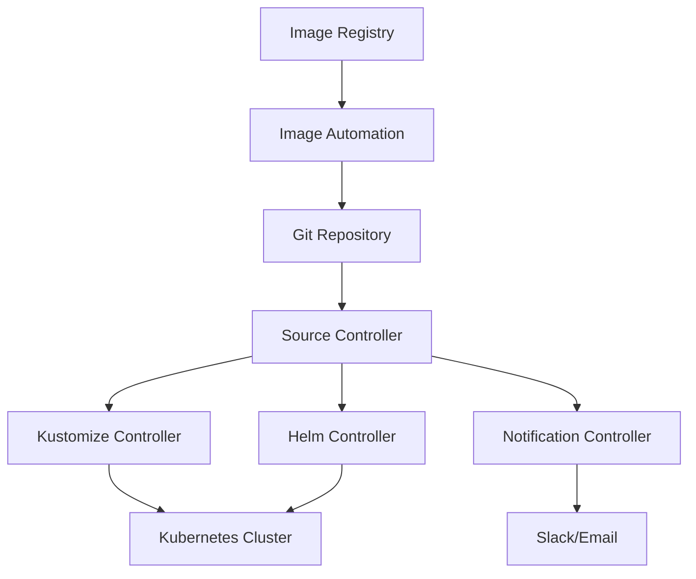
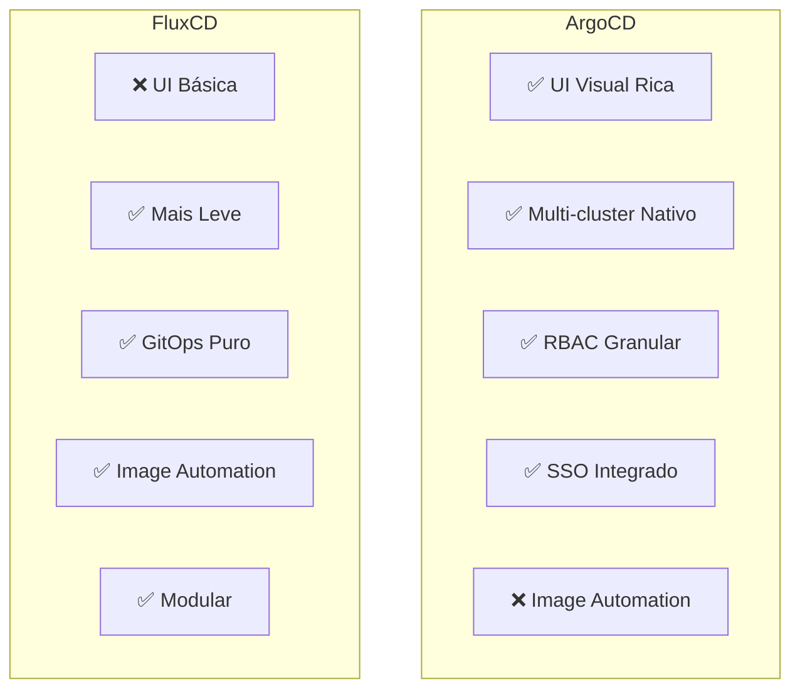
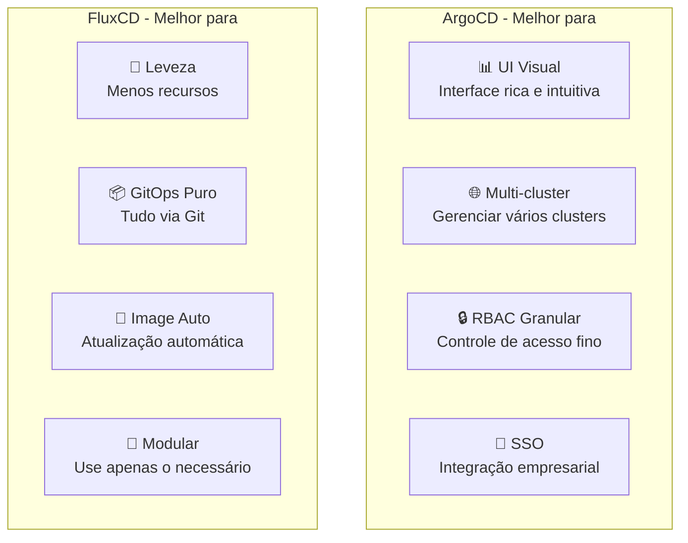
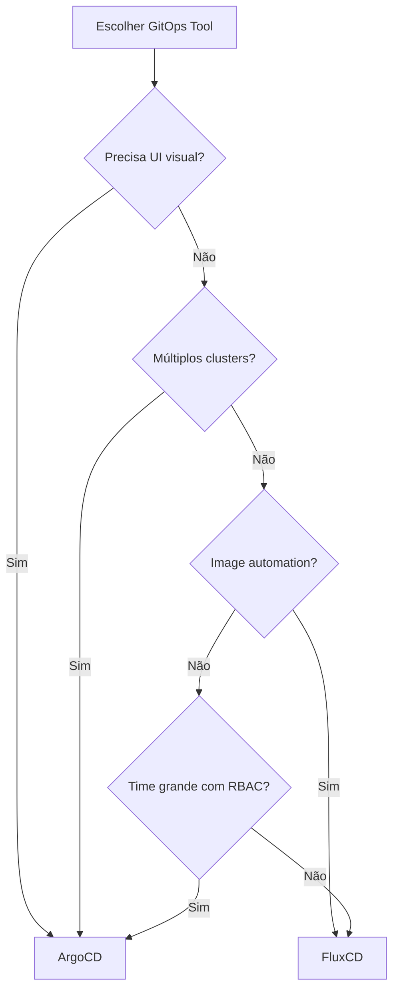
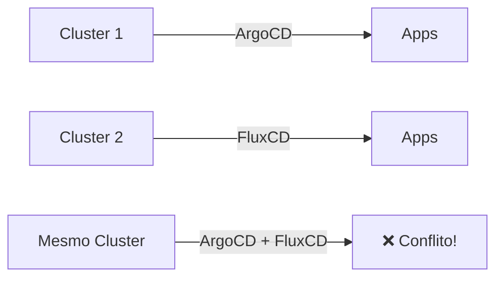

# 🎬 Vídeo 4.3 - FluxCD e Comparação

**Aula**: 4 - GitOps  
**Vídeo**: 4.3  
**Temas**: FluxCD; Image Automation; ArgoCD vs FluxCD; Escolha  

---

## ⚠️ Pré-requisitos

**IMPORTANTE**: Este vídeo assume que você já tem:
- ✅ Cluster EKS `cicd-lab` criado na **Aula 01** (repositório da Aula 01)
- ✅ kubectl configurado com acesso ao cluster
- ✅ Conhecimento de ArgoCD (Vídeos 4.1 e 4.2)

**Se ainda não criou o cluster:**
- Volte ao **repositório da Aula 01** e crie o cluster EKS
- O cluster deve ter o nome: `cicd-lab`

---

## 📚 Parte 1: Conceito FluxCD

### Passo 1: O que é FluxCD?

#### Arquitetura FluxCD v2 (GitOps Toolkit)



**Componentes FluxCD:**
- **Source Controller** - Monitora Git, Helm repos, S3 buckets
- **Kustomize Controller** - Aplica manifests Kustomize
- **Helm Controller** - Gerencia Helm releases
- **Notification Controller** - Envia alertas (Slack, Teams, etc)
- **Image Automation** - Atualiza tags de imagem automaticamente

#### ArgoCD vs FluxCD - Visão Geral



---

## ⚙️ Parte 2: Instalar FluxCD

### Passo 2: Instalar Flux CLI

```bash
# macOS
brew install fluxcd/tap/flux

# Linux
curl -s https://fluxcd.io/install.sh | sudo bash

# Verificar
flux --version
```

### Passo 3: Verificar Cluster

```bash
# Pre-check
flux check --pre

# Deve mostrar:
# ✔ Kubernetes 1.28.0 >=1.26.0
# ✔ prerequisites checks passed
```

### Passo 4: Bootstrap FluxCD

```bash
# Exportar token GitHub
export GITHUB_TOKEN=<seu_token>
export GITHUB_USER=<seu_usuario>

# Bootstrap Flux
flux bootstrap github \
  --owner=$GITHUB_USER \
  --repository=fiap-dclt-aula04 \
  --branch=main \
  --path=aula-04/flux-system \
  --personal

# Flux vai:
# 1. Criar namespace flux-system
# 2. Instalar componentes Flux
# 3. Criar manifests no Git
# 4. Configurar sync automático
```

### Passo 5: Verificar Instalação

```bash
# Ver pods Flux
kubectl get pods -n flux-system

# Ver GitRepository
flux get sources git

# Ver Kustomizations
flux get kustomizations
```

---

## 📁 Parte 3: Configurar FluxCD

### Passo 6: Ver Estrutura Flux

```bash
cd fiap-dclt-aula04

# Ver estrutura
tree gitops-repo/clusters/
```

**Estrutura:**
```
gitops-repo/
└── clusters/
    └── production/
        ├── fiap-todo-api-source.yaml      # GitRepository
        └── fiap-todo-api-kustomization.yaml  # Kustomization
```

### Passo 7: Ver GitRepository Source

```bash
# Ver source
cat gitops-repo/clusters/production/fiap-todo-api-source.yaml
```

**fiap-todo-api-source.yaml:**
```yaml
apiVersion: source.toolkit.fluxcd.io/v1
kind: GitRepository
metadata:
  name: fiap-todo-api
  namespace: flux-system
spec:
  interval: 1m
  url: https://github.com/josenetoo/fiap-dclt-aula04
  ref:
    branch: main
  ignore: |
    # exclude all
    /*
    # include only specific path
    !/gitops-repo/applications/fiap-todo-api/
```

### Passo 8: Ver Kustomization

```bash
# Ver kustomization
cat gitops-repo/clusters/production/fiap-todo-api-kustomization.yaml
```

**fiap-todo-api-kustomization.yaml:**
```yaml
apiVersion: kustomize.toolkit.fluxcd.io/v1
kind: Kustomization
metadata:
  name: fiap-todo-api
  namespace: flux-system
spec:
  interval: 5m
  sourceRef:
    kind: GitRepository
    name: fiap-todo-api
  path: ./gitops-repo/applications/fiap-todo-api/overlays/production
  prune: true
  targetNamespace: fiap-todo-flux
  healthChecks:
    - apiVersion: apps/v1
      kind: Deployment
      name: fiap-todo-api
      namespace: fiap-todo-flux
```

---

## 🚀 Parte 4: Deploy com FluxCD

### Passo 9: Aplicar Manifests Flux

```bash
# Criar namespace
kubectl create namespace fiap-todo-flux

# Aplicar GitRepository
kubectl apply -f gitops-repo/clusters/production/fiap-todo-api-source.yaml

# Aplicar Kustomization
kubectl apply -f gitops-repo/clusters/production/fiap-todo-api-kustomization.yaml

# Ver status
flux get sources git
flux get kustomizations
```

### Passo 10: Ver Reconciliação

```bash
# Flux vai reconciliar automaticamente
# Ver logs
flux logs --follow

# Ver pods da aplicação
kubectl get pods -n fiap-todo-flux

# Ver deployment
kubectl get deployment -n fiap-todo-flux
```

---

## 🖼️ Parte 5: Image Automation

### Passo 11: Configurar Image Repository

```yaml
# image-repository.yaml
apiVersion: image.toolkit.fluxcd.io/v1beta2
kind: ImageRepository
metadata:
  name: fiap-todo-api
  namespace: flux-system
spec:
  image: YOUR_ECR_URI/fiap-todo-api
  interval: 1m
  secretRef:
    name: ecr-credentials
```

### Passo 12: Configurar Image Policy

```yaml
# image-policy.yaml
apiVersion: image.toolkit.fluxcd.io/v1beta2
kind: ImagePolicy
metadata:
  name: fiap-todo-api
  namespace: flux-system
spec:
  imageRepositoryRef:
    name: fiap-todo-api
  policy:
    semver:
      range: 1.0.x
```

### Passo 13: Configurar Image Update Automation

```yaml
# image-update.yaml
apiVersion: image.toolkit.fluxcd.io/v1beta1
kind: ImageUpdateAutomation
metadata:
  name: fiap-todo-api
  namespace: flux-system
spec:
  interval: 1m
  sourceRef:
    kind: GitRepository
    name: flux-system
  git:
    checkout:
      ref:
        branch: main
    commit:
      author:
        email: fluxcdbot@users.noreply.github.com
        name: fluxcdbot
      messageTemplate: |
        🤖 Update image {{range .Updated.Images}}{{println .}}{{end}}
    push:
      branch: main
  update:
    path: ./aula-04/gitops-repo/applications/fiap-todo-api/overlays/production
    strategy: Setters
```

---

## 🔄 Parte 6: Testar FluxCD

### Passo 14: Fazer Mudança no Git

```bash
cd fiap-dclt-aula04

# Editar deployment
cat >> gitops-repo/applications/fiap-todo-api/overlays/production/deployment-patch.yaml << 'EOF'
  replicas: 4  # Aumentar para 4
EOF

# Commit e push
git add gitops-repo/
git commit -m "feat: aumentar replicas para 4"
git push origin main
```

### Passo 15: Ver Reconciliação Automática

```bash
# Flux detecta mudança (1 min)
flux get kustomizations --watch

# Ver pods sendo criados
kubectl get pods -n fiap-todo-flux -w

# Ver deployment
kubectl get deployment -n fiap-todo-flux
# Deve mostrar 4 replicas!
```

---

## ⚖️ Parte 7: ArgoCD vs FluxCD

### Passo 16: Comparação Detalhada

#### Matriz de Comparação Visual



**Tabela comparativa:**

| Feature | ArgoCD | FluxCD | Vencedor |
|---------|--------|--------|----------|
| **UI** | ✅ Rica e visual | ❌ Básica (CLI) | ArgoCD |
| **CLI** | ✅ Completo | ✅ Completo | Empate |
| **Multi-cluster** | ✅ Nativo | ⚠️ Manual | ArgoCD |
| **RBAC** | ✅ Granular | ⚠️ K8s RBAC | ArgoCD |
| **SSO** | ✅ Sim | ❌ Não | ArgoCD |
| **Image Automation** | ❌ Não | ✅ Built-in | FluxCD |
| **Helm** | ✅ Nativo | ✅ Nativo | Empate |
| **Kustomize** | ✅ Nativo | ✅ Nativo | Empate |
| **Webhooks** | ✅ Sim | ✅ Sim | Empate |
| **Notifications** | ✅ Sim | ✅ Sim | Empate |
| **Peso/Recursos** | ⚠️ Pesado | ✅ Leve | FluxCD |
| **Complexidade** | ⚠️ Média | ✅ Simples | FluxCD |

### Passo 17: Guia de Decisão



**Use ArgoCD se:**
- ✅ Precisa de **UI visual** para monitoramento
- ✅ Gerencia **múltiplos clusters**
- ✅ Múltiplos times precisam **RBAC granular**
- ✅ **SSO** é requisito (LDAP, OAuth, SAML)
- ✅ Quer **interface amigável** para desenvolvedores
- ✅ Empresa grande com **governança rígida**

**Use FluxCD se:**
- ✅ Quer **solução leve** (menos recursos)
- ✅ **GitOps puro** - tudo via Git
- ✅ **Image automation** é importante
- ✅ **Infraestrutura como código** (IaC)
- ✅ Integração com **Terraform/Crossplane**
- ✅ Time pequeno, **simplicidade** é prioridade

**Pode usar ambos?**



- ⚠️ **Não recomendado** no mesmo cluster
- ⚠️ Podem **conflitar** (ambos tentam gerenciar recursos)
- ✅ **Pode usar** em clusters diferentes
- ✅ Exemplo: ArgoCD em prod, FluxCD em dev

---

## 🎓 Parte 8: Conceitos Aprendidos

### Passo 18: Recapitular

**FluxCD:**
- ✅ GitOps Toolkit modular
- ✅ Image automation built-in
- ✅ Mais leve que ArgoCD
- ✅ Tudo via Git (sem UI)
- ✅ Reconciliação automática

**Comparação:**
- **ArgoCD**: Melhor para times grandes, multi-cluster, precisa UI
- **FluxCD**: Melhor para simplicidade, automação, GitOps puro

**Ambos:**
- ✅ Pull model (GitOps)
- ✅ Self-healing
- ✅ Auditoria via Git
- ✅ Rollback fácil
- ✅ Declarativo

---

## 🧹 Parte 9: Limpeza

### Passo 19: Remover Recursos

```bash
# Remover FluxCD
flux uninstall

# Remover ArgoCD
kubectl delete namespace argocd

# Remover namespaces das aplicações
kubectl delete namespace fiap-todo-prod
kubectl delete namespace fiap-todo-flux

# Deletar node group primeiro
aws eks delete-nodegroup \
  --cluster-name cicd-lab \
  --nodegroup-name workers \
  --region us-east-1 \
  --profile fiapaws

# Aguardar node group ser deletado
aws eks wait nodegroup-deleted \
  --cluster-name cicd-lab \
  --nodegroup-name workers \
  --region us-east-1 \
  --profile fiapaws

# Deletar cluster
aws eks delete-cluster \
  --name cicd-lab \
  --region us-east-1 \
  --profile fiapaws

# Aguardar cluster ser deletado
aws eks wait cluster-deleted \
  --name cicd-lab \
  --region us-east-1 \
  --profile fiapaws

echo "✅ Cluster deletado com sucesso!"
```

---

**FIM DO VÍDEO 4.3** ✅

**FIM DA AULA 4 - GitOps** 🎓
